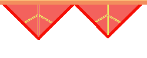
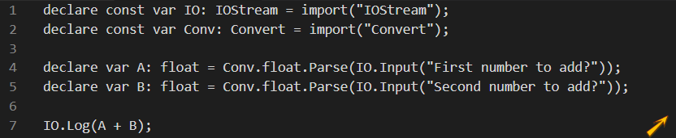
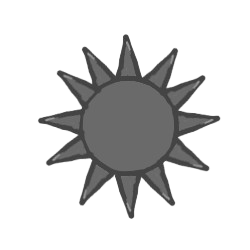
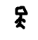

<!--
Usable Image Assets:
Assets/ProfilePicture.png
Assets/Header.png
Assets/BloodRapier.png
Assets/Sawblade.png
Assets/MrSteeckman.png
Projects/Forward/ForwardCode.png
-->

## Meet Redful!

Hello! I'm **Redful** — A high school student with a fervent love for programming & drawing. I currently know 9 languages spread across programming, markup, & styling.

My pronouns are **He/They.**

## Fun Fact!
Did you know that the drawings (not icons) in this README file were drawn by me? Cool right?

## Skills!
This section shows the languages I know, IDEs I use, and etc!
### Languages:
#### Programming

#### Markup & styling

### Used IDEs:

### ETC:

## Currently Learning!
This section shows languages/platforms I am currently learning to use.
#### Languages

#### Platforms

## Projects!
### Forward Programming Language

Forward is a very explicit, general purpose imperative & interpreted programming language implemented in C++. \
[Learn More (DOWNLOAD)]()

### Woah, careful dude!
You've reached the bottom of my profile README! Thanks for taking the time to read it. \
Also, don't try going down more, you will get shred to pieces. \

##### hello i am under da shredder pleas help meh